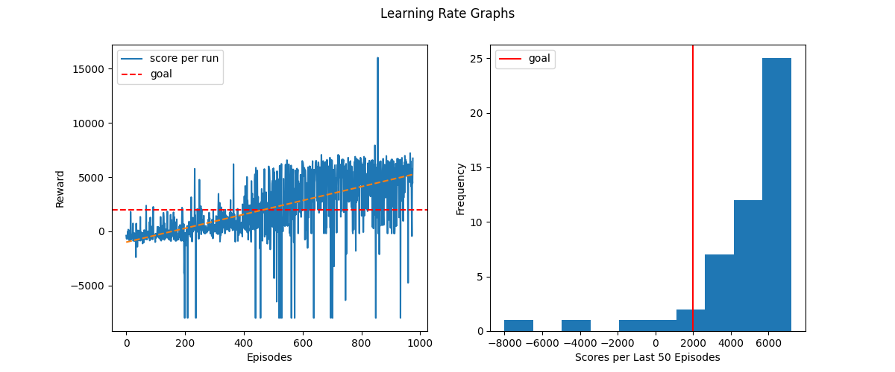
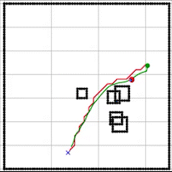

Creators: Cody Grogan and Jarom Burr

# Intro

The purpose of this project is to create a low fidelity simulation for a turtle bot in a environment with obstacles. However, to do this, we also wanted to
make the hardware on the turtle bot as minimal and cost effective as possible. This lead us to use 4 ultrasonic sensors at the front, back, left, and right
of the turtle bot. We then use the state of the turtle bot as an input to the policy and use the DDPG algorithm to achieve continuous control of the bot.

This project has three fundamental parts:

- The Simulation environment
- Path planner
- Reinforcement Learning

## Simulation Environment
For the simulation environment, we decided to render each frame of the simulation using matplotlib as it is relatively light weight and our knowledge
level using it is high. Like many Reinforcement learning environments, we modeled our simulation based on the OpenAI gym environments so the use of the 
environment would be familiar to most.

## Planner
For the planner, my partner and I use an A star planner to plot an optimal path through the obstacles to the goal point.

## Reinforcement Learning

### RL Inputs
For the inputs to the policy network we use:

- x and y unit vectors to the path
- x and y unit vectors to the goal
- distance data from each ultrasonic sensor
- the x , y and theta of the robot. (x and y are likely not necessary)
- the difference in the heading of the robot from the heading of the path (used to show robot where the path is headed)

### RL Reward
Crafting the reward and the termination conditions for the robot proved to be difficult. Allowing the bot to move freely in the simulation until it hit a wall or
an obstacle made training extremely long. However, constraining the bot to a small area around the path yielded extremely jittery solutions when the bot got close
to the edge and had an obstacle. In addition, we also needed to craft a reward which incentivized the bot achieve its overall goal.

The reward for the RL has both sparse and temporal components:

- Sparse
    - Negative reward when hitting an obstacle
    - Positive reward for reaching the goal
    - Negative reward if bot goes too far from path
- Temporal
    - Reward which is +/- depending on how close bot is to obstacle
    - Reward which is +/- depending on how far the bot is from the path
    - Reward which incentivizes going toward the goal and penalizes moving away from it
    - Reward which punishes bot for having different heading from path (except for within a tolerance)

### RL 

For the reinforcement learning we opted to use DDPG which allowed us to control the turtle bot continuously. However this had many challenges within itself.
The first was finding the correct number of layers and number of nodes that would allow the turtle bot to reach the goal with the data at hand. The second was
determining which method of discovery and exploitation to allow the bot to discover the best strategy to reach the goal. For the discovery, we opted to use OU
Action noise to give some randomness to the robot's actions but not entirely random as to not disterb the convergence of the policy.

For the policy and quality networks, we opted to use 3 hidden layers with 300, 200, and 100 layers respectively. The learning rate is shown below,

From the graph on the left we see the NN is converging slowly and generalizing to the problem. The main issue with the final result of the project is -8000 outliers
which are not the fault of the NN. As mentioned earlier, these episodes result in such a low reward because the bot gets stuck close to an obstacle and almost
out of range of the path. As a result of this, the robot gets stuck going back and forth until it reaches the fail safe (-8000 reward) or it finds its way to the
path. The most interesting about this very specific situation is that the learns to avoid them as the learning progresses because the number of fail safe episodes
decreases.

From the graph on the left, we see that the NN is exceeding expectations nearly everytime indicative of the convergence. The 2000 line on the graph was determined
to be on average where the robot reached the goal within a reasonable amount of time. The 6000 episodes usually mean the robot traveled smoothly through the 
environment without getting too close to obstacles.

An episode like this achieved an overall reward of 5500.
